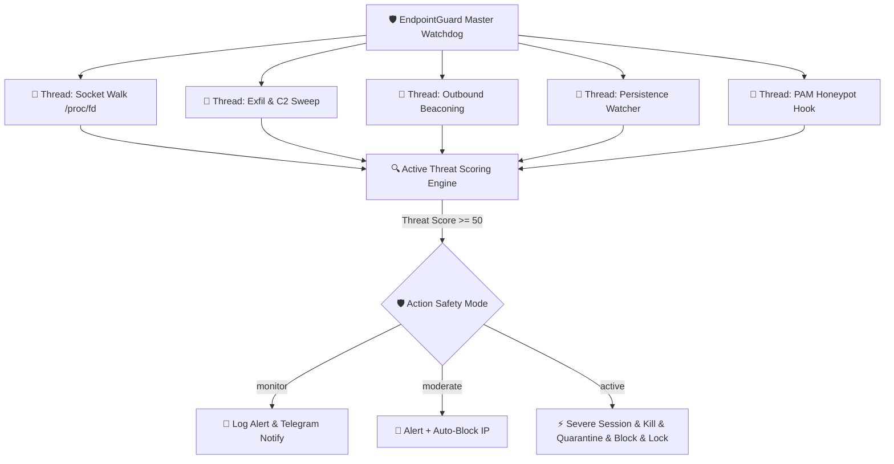
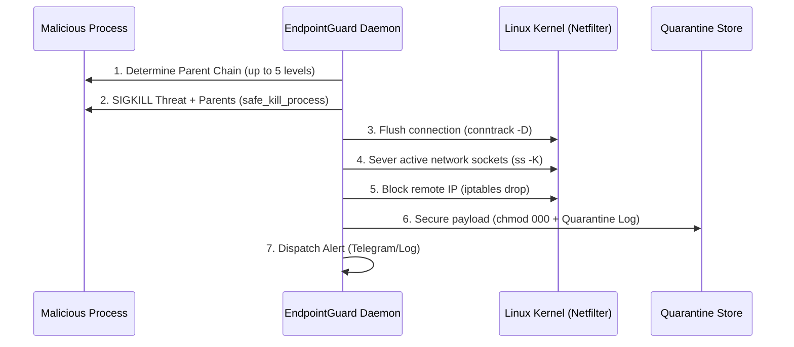

# 🔬 Technical Architecture Manual

This document provides a deep dive into the inner workings, modular threads, and threat-scoring engine of **EndpointGuard v5.0**.

---

## 🏗️ System Overview

EndpointGuard runs as a continuous system service or standalone daemon. It operates via modular monitoring threads orchestrated by a master watchdog loop. Rather than scanning heavy file structures constantly, it targets dynamic runtime resources in the Linux kernel (`/proc` filesystem, network sockets, active descriptors) to maintain a **negligible CPU footprint (<1%)** and low memory profile (~25 MB).

---

## ⚡ Component Deep Dive

### 1. Reverse-Shell Hunter (`/proc/<pid>/fd`)
Rather than relying on fragile string patterns or process command-line arguments (which attackers easily obfuscate by renaming executables or pre-loading memory), the hunter targets **file descriptors**.

1. **Proc Walk**: It iterates through `/proc/[0-9]*/` directories.
2. **Interpreter Filter**: It identifies potential interpreters/shells (`bash`, `python`, `perl`, `socat`, etc.).
3. **Descriptor Analysis**: It checks if `0` (stdin), `1` (stdout), or `2` (stderr) are symlinked to a socket (e.g. `socket:[12345]`).
4. **Socket Resolution**: It correlates the socket inode number with active network sockets parsed from `/proc/net/tcp` and `/proc/net/tcp6`.
5. **Score Verification**: If the socket destination points to a non-loopback, non-local IP address, a threat score is immediately calculated.

### 2. C2 & Exfiltration Sweep
Scans volatile storage locations (`/tmp`, `/var/tmp`, `/dev/shm`) and standard user home directories for dropped scripts. It reads file content and active `/proc/<pid>/cmdline` strings looking for exfiltration structures:
* Discord webhooks (`discord.com/api/webhooks`)
* Telegram Bot API paths (`api.telegram.org`)
* Ngrok, Serveo, and Cloudflare tunnels
* Raw paste bins and anonymous upload staging endpoints

### 3. Outbound Connection Beaconing
Traditional security tools miss slow, periodic C2 "heartbeats". EndpointGuard tracks outbound established connections in a sliding 15-minute window:
$$\text{Beacon Score} = f(\text{Frequency}, \text{Interval Standard Deviation})$$
If the standard deviation of connection intervals falls below **30 seconds** across 4 or more connections, the remote target is flagged as a C2 beacon and blocked.

### 4. Active Mitigation Workflow
Once a process crosses the threshold (Threat Score $\ge 50$):

---

## 🔒 Threat Scoring Rubric

Each indicator generates a specific threat score. Scores are cumulative:

| Threat Indicator | Points | Context / Action |
|:---|:---:|:---|
| **Shell Socket on Stdio** | 50 | *The smoking gun*. Instant response in Active mode. |
| **C2 Domain Pattern Match** | 30 | Matches known reverse proxy or web hook tunnels. |
| **Honeypot Trigger** | 50 | Untrusted user logged into a protected/disabled account. |
| **Beacon Detection** | 30 | Connection with static time interval signature. |
| **Malicious Dropper Path** | 20 | Volatile folders hosting un-whitelisted ELF/Scripts. |
